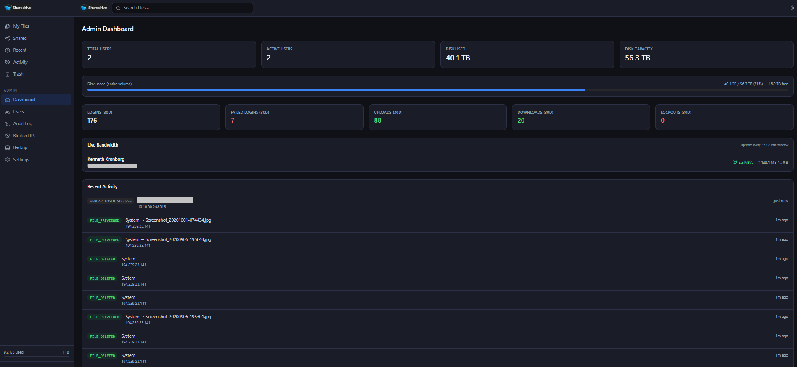

# Sharedrive

Privacy-first self-hosted file sharing and personal cloud platform for secure storage, syncing, and sharing, WebDAV, collaborative document editing, built-in text/code editor, granular sharing, TOTP 2FA, full admin dashboard — packaged as a single Docker container.



*Admin dashboard — disk usage, 30-day stats, live bandwidth per user (updates every 3 s), and real-time activity feed.*

---

## Changelog

### v1.1.4 — 24 April 2026

#### New features
- **Retro media player transport buttons** — Play, Pause, Previous, and Next controls in the sidebar player are now neumorphic press-down buttons styled after a vintage high-end tape deck. Each button physically depresses on click (inset shadow + 1 px translate) and lights up with a colour glow when active (green for play, purple for shuffle). Replaces the previous flat icon buttons.
- **LED segment display** — a VFD-style readout panel replaces the plain text track name. Shows a cyan track-number counter (`01`, `02` …) and an amber scrolling track-name ticker that animates left–right for long titles. Clicking the display expands/collapses the track list.
- **Upload folder** — a new "Upload mappe" button in the Files toolbar (desktop only) lets you select an entire local folder including subfolders. Sharedrive recreates the full folder hierarchy on the server and uploads each file into the correct subfolder. Available on browsers that support `webkitdirectory`.
- **Mine delinger tab** — the "Delt med mig" page now includes a "Mine delinger" tab listing all shares you have created, with interactive per-permission toggles (View / Upload / Edit / Rename / Delete / Re-share) that update without leaving the page, and a "Navigate to folder" button that jumps directly to the shared folder in the file manager.

#### Bug fixes
- **WebDAV: argon2id latency on ARM** — app-password verification (argon2id) now uses an in-memory cache (5-minute TTL, SHA-256 key). Only the first request per credential window pays the 1–3 s hashing cost; subsequent requests on ARM servers (Raspberry Pi, ARM VPS) are instant.
- **WebDAV: rate-limiter exhaustion** — the Redis sliding-window rate limiter previously counted every auth attempt including successful ones, which exhausted the budget for legitimate clients during normal use. The counter now only increments on failed authentication attempts.
- **WebDAV: rename fails for root-level files** — renaming a file located in the WebDAV root (no parent folder) produced a PostgreSQL uuid cast error due to a `$2::uuid` cast on a null value. Fixed by using a nullable UUID helper.
- **Folder delete returns 400** — deleting a folder that contained files triggered a database trigger (`trg_check_parent_owner`) that re-validated parent ownership during the soft-delete cascade, incorrectly firing after `deleted_at` was already set. Migration `0037` adds an early return when `NEW.deleted_at IS NOT NULL`.

---

### v1.1.3 — 23 April 2026

#### New features
- **Audio equaliser** — Bass, Volume, and Treble neumorphic dials replace the flat volume slider in both the sidebar mini-player and the audio preview modal. Each dial sweeps ±12 dB via a Web Audio API `BiquadFilterNode` chain (low-shelf 200 Hz for bass, high-shelf 4 kHz for treble) with a `GainNode` for volume. Drag up to increase, down to decrease; all three dials remember their value for the current playback session.
- **Admin → Storage: corrupt file scanner** — scans every file blob on disk and flags entries that are structurally broken (truncated JPEG, invalid PNG/GIF/WebP header, non-PDF magic bytes, etc.). Results are cached until you re-run the scan. You can preview a corrupt file before deleting it, or bulk-purge all flagged entries in one click. The purge removes both the database record and the file on disk.
- **Admin → Storage: orphan blob scanner** — finds files on disk that have no matching database record (left behind by failed uploads or manual interventions). Each orphan can be previewed, permanently deleted, or restored as a real file into a special "Restored from cleanup" folder. Bulk-delete is also available.
- **Admin → Storage: scheduled scans** — configure corrupt and orphan scans to run automatically on an hourly, daily, weekly, or monthly schedule so storage hygiene is maintained without manual intervention.
- **Trash enhancements** — files in the trash can now be previewed in the full preview modal before you decide to restore or permanently delete them. Bulk restore and bulk permanent delete buttons let you process multiple items at once.

#### Bug fixes
- **Admin backup history** — the "Previous backups" list on the Admin → Backup page was always empty when the `BACKUPS_ROOT` environment variable was not explicitly set. The handler now falls back to `/mnt/backup` (the Unraid default mount point) exactly like the user-facing backup handler does, so history and downloads work out of the box on Unraid without any extra configuration.
- **Corrupt scan coverage** — SVG, HTML, XML, and other text-based formats are now excluded from the binary-integrity check to avoid false positives. JPEG/PNG/GIF/WebP headers are validated using `image.DecodeConfig` for accuracy; all other binary types use a 512-byte magic-byte check.
- **Storage scan pagination** — the corrupt and orphan scanners now process every file in the database (no 5 000-row cap) with deterministic ordering, so large libraries are fully covered.

---

### v1.1.2 — 21 April 2026

#### New features
- **File search** — instant search across all your own files and files shared with you, accessible from the header bar. Results are grouped (My files / Shared with me). Clicking a result navigates to the file's folder, opens the correct viewer (image preview, OnlyOffice editor, text editor), and scrolls the file into view with a brief visual highlight that fades when you scroll or interact.
- **Preview navigation** — Previous / Next arrow buttons in the preview modal header let you step through all files in the current folder without closing and re-opening. Keyboard ← / → shortcuts work too. Wraps around at both ends.
- **Delete from preview** — a trash-can icon in the preview header deletes the current file and automatically jumps to the next one. A large "Delete corrupted file" button also appears on the error screen when an image fails to load — making it easy to clean up files that were broken during migration from an old server.

#### Bug fixes
- **Mobile layout** — fixed overlapping PWA install banner, cramped toolbar on small screens, and the per-file ⋮ menu rendering off-screen. Toolbar now stacks vertically on mobile and uses a bottom-sheet menu.
- **Image preview on desktop browsers** — files migrated from older servers were stored with `mime_type = application/octet-stream`. Chrome/Firefox on desktop strictly honour the Content-Type header and refused to show the image; mobile browsers guessed from the file extension and showed it fine. The preview endpoint now falls back to MIME detection from the file extension, so all browsers render images correctly.
- **Preview highlight after closing a viewer** — the file row highlight (shown after navigating from search results) was being cleared immediately when OnlyOffice, the text editor, or the image preview closed, because the `navigate` call dropped the `?highlight=` URL parameter. All three `onClose` handlers now preserve the parameter.
- **Stale error state in image preview** — navigating from a broken image to a healthy one showed "Failed to load image" for the healthy file because React reused the component instance. Fixed by keying `ImageRenderer` on the preview URL so it remounts on every navigation.

---

## Features at a glance

### Files
- List and grid view with breadcrumb navigation
- **Image thumbnails** — raster images (JPEG, PNG, GIF, WebP) render a 256 px thumbnail in the file list and grid; other types fall back to an icon
- Drag-and-drop upload zone + file picker button
- **Resumable uploads** via the [tus protocol](https://tus.io/) — survives network interruptions and browser restarts
- **Direct upload URL** — bypass Cloudflare for large files at full speed (configured in admin settings)
- Live upload progress panel with per-file speed (MB/s) and ETA
- Create folders, rename, **move**, **duplicate** (right-click or context menu)
- Right-click context menu: open, download, share, rename, move, duplicate, add to playlist, trash
- Multi-select with shift-click or checkbox; bulk download as ZIP, bulk trash
- **Download ZIP dialog** — optional password protection (auto-generated or custom), with a clear password display and a "Download started" confirmation step
- **Mobile toolbar dropdown** — compact action menu on small screens; all file actions accessible
- **Recent files** — last 50 accessed or modified items
- **Activity feed** — personal history of the last 50 file events (upload, download, preview, delete, etc.) with timestamp and IP address; accessible via the sidebar
- **File search** — instant search across all your own files and files shared with you; results grouped by ownership; clicking a result navigates directly to the file's folder, opens the correct viewer (image preview, OnlyOffice, text editor), and scrolls the file into view with a brief visual highlight

### File Preview
- **PDF** — rendered page-by-page in the browser via PDF.js with a loading spinner
- **Office documents** — converted server-side to PDF via [Gotenberg](https://gotenberg.dev/) (built-in, no separate container); shows a "Preparing preview…" spinner while conversion runs. Supported formats include:
  - **Word**: DOC, DOCX, DOCM, DOT, DOTX, RTF, ODT, OTT
  - **Excel**: XLS, XLSX, XLSM, XLSB, XLTX, CSV, ODS, OTS
  - **PowerPoint**: PPT, PPTX, PPTM, POTX, ODP, OTP
  - **Other**: EPUB, HTML, XHTML, VSD, VSDX, PUB, and many more
- **Images** (JPEG, PNG, GIF, WebP, SVG) — full-size preview with a fade-in loading state; correct MIME type always served regardless of how the file was originally uploaded
- **Previous / Next navigation** — arrow buttons (and keyboard ← →) step through all files in the current folder; wraps around at both ends
- **Delete from preview** — trash-can icon in the header deletes the current file and jumps to the next one automatically; a prominent "Delete corrupted file" button also appears on the error screen when an image fails to load
- **Video** (MP4, WebM, OGG, MOV) — native browser player
- **Audio** (MP3, WAV, AAC, M4A, Opus) — native browser player; FLAC detected at render time — shows a download-to-play fallback if the browser does not support it
- **3D models** (STL, 3MF) — interactive WebGL viewer (Three.js)
- **Text & code** — syntax-highlighted viewer; previews truncated at 1 MB with a notice
- **Print button** — prints PDF, office, image, and text files directly from the preview modal using the browser's print dialog (no server-side printer required)

### OnlyOffice Integration (optional)
- **Collaborative document editing** — connect an external [OnlyOffice Document Server](https://helpcenter.onlyoffice.com/installation/docs-community-install-docker.aspx) for full in-browser editing of Word, Excel, and PowerPoint files
- **Supported formats** — DOCX, XLSX, PPTX, ODT, ODS, ODP, CSV, and more — opened directly in the OnlyOffice editor
- **New document creation** — create blank Word, Excel, or PowerPoint documents from the "New document" dropdown in any folder
- **Shared files & public links** — OnlyOffice editing works on files shared with other users and on public share links (respects per-share permissions)
- **Easy setup** — enter the OnlyOffice Document Server URL in Admin → System Settings; Sharedrive validates the connection with a live connectivity test
- **Security** — document download URLs carry short-lived signed tokens; CSP headers are updated dynamically to allow the OnlyOffice origin

### Text Editor
- **Built-in code & text editor** — powered by [Monaco Editor](https://microsoft.github.io/monaco-editor/) (the engine behind VS Code), opens directly in the browser
- **Syntax highlighting** — automatic language detection for 40+ file types including Markdown, JSON, YAML, XML, HTML, CSS, JavaScript, TypeScript, Python, Go, SQL, Shell scripts, Dockerfiles, config files, and many more
- **Full editing** — edit and save text files in place; unsaved changes are tracked with a visual indicator
- **Create new files** — create blank `.txt`, `.md`, or `.json` files from the "New document" dropdown
- **Read-only mode** — files larger than 5 MB open read-only; files over 10 MB show a size warning instead
- **Works everywhere** — available on your own files, shared files, and public share links (respects permissions)
- **Dark mode** — follows the system/site theme automatically

### Download Rate Limiting
- **Per-user limits** — 200 single-file downloads / hour; 30 ZIP downloads / hour
- **Per-IP limits** — 600 single-file downloads / hour; 60 ZIP downloads / hour
- Returns HTTP 429 with `Retry-After: 3600` on breach

### Sharing
- Share files or folders with **users**, **groups**, or a **public link**
- Per-share permissions: View, Upload (folders only), Edit, Rename, Delete, Re-share
- Optional expiry date per share
- **Pending shares** — invites a non-registered email and converts the share on registration
- Share notification emails and invitation emails via SMTP

### M3U Playlists
- Create M3U playlists directly from selected audio files in the file manager
- **Persistent sidebar player** — plays in the background while navigating; collapses to a mini-bar; expands to show track list with per-track remove button and Bass / Volume / Treble neumorphic dials
- **Retro transport controls** — Play, Pause, Previous, and Next are neumorphic press-down buttons styled after a vintage tape deck; physically depress on click and glow when active
- **LED display** — VFD-style panel shows a cyan track-number counter and an amber scrolling track-name ticker; click to expand/collapse the track list
- **Mobile bottom bar** — floating mini-player on small screens; tap to expand full sheet with track list and controls
- **Audio equaliser** — neumorphic dial controls for Bass (low-shelf 200 Hz), Volume, and Treble (high-shelf 4 kHz) via the Web Audio API; available in both the sidebar player and the audio preview modal; each dial sweeps ±12 dB
- **Shuffle mode** — randomises track order; toggles with a single click; highlighted when active
- **Cross-device state sync** — active playlist, current track index, volume and shuffle mode are saved server-side (per user) and restored on any device or browser after login; instant hydration from localStorage on same device
- Add files or folders to the current playlist from the context menu ("Add to playlist")
- Playlist files are editable (add/remove tracks, max 50)
- **Upload folder** — select an entire local folder from the Files toolbar; Sharedrive recreates the folder hierarchy on the server and uploads each file into the correct subfolder

### Backup & Restore
- **Per-user encrypted backup** — HMAC-SHA256 signed gzip JSON export (metadata only, no blobs)
- **Selective export** — choose exactly which folders/files to include using a tree picker
- **Tertiary storage** — automatically copies finished backups to a local path (e.g. a USB drive or NAS mount at `/mnt/backup`); configurable retention (number of archives to keep)
- **Buddy backup** — push encrypted backups to a remote trusted Sharedrive instance over HTTPS; configure the peer URL and per-user token per user
- **Auto-backup schedule** — configurable interval (hourly, daily, weekly); only backs up when the file tree has actually changed (SHA-256 change detection)
- Backup exports include real folder structure and filenames for easy inspection
- Archives are `.zip` files compatible with 7-Zip and standard tooling
- Full restore available from Admin → Backup or during first-run wizard


- Soft-delete with automatic ownership transfer (guest-uploaded files land in the folder owner's trash)
- **Preview from trash** — open any trashed file in the full preview modal (image, PDF, video, audio, etc.) before deciding what to do with it
- **Bulk restore / bulk permanent delete** — select multiple trashed items and restore or permanently delete them in one action
- Restore individual files or empty the entire trash
- Configurable per-user retention period (auto-cleanup)

### Authentication
- Email + Argon2id password
- **TOTP 2FA** (RFC 6238) with 10 single-use backup codes; secrets stored AES-256-GCM encrypted
- **Trusted devices** — 30-day TOTP bypass cookie after first verification
- Session management — list and revoke individual active sessions
- **Self-service password reset** via email token (1-hour expiry)
- **Forced password change** — admin can require a reset on next login
- Invitation-based onboarding with 7-day invite links

### Security
- **Progressive IP lockout** — Redis sliding-window counters with automatic tier escalation (60 min → 6 h → 24 h)
- **Manual IP block** (permanent, admin-managed) + CIDR whitelist to bypass all rate limiting
- **Download rate limiting** — sliding-window Redis counters, separate limits per user and per IP for single-file and ZIP downloads
- Passwords: Argon2id
- Sessions: opaque 256-bit tokens, SHA-256-stored in DB
- TOTP secrets: AES-256-GCM at rest
- Security headers on every response: HSTS, CSP, `X-Frame-Options: DENY`, `Referrer-Policy`, `Permissions-Policy`
- CSP `connect-src` updated dynamically with the configured direct upload URL
- Audit log: immutable, covers all auth, file, share, and admin events — never deleted by the application

### Admin Dashboard
- **User management** — create, edit, lock/unlock, force password reset, re-invite, view sessions
- **Promote / Demote** — change a user's role between `user` and `admin` directly from the user table; a last-admin guard prevents the final admin from being demoted
- **Quota management** — per-user storage quota with presets (10 GB – 1 TB) and custom values
- **Per-user limits** — max upload size, daily bandwidth cap, WebDAV toggle
- **Live Bandwidth panel** — real-time per-user upload/download rate (updated every 3 s); tracks both browser (TUS resumable) and WebDAV (Windows Explorer / macOS Finder) transfers as they stream
- **Guest accounts** — limited role; redirect to Shares view; promotable to full user
- **Group management** — create groups, add/remove members, use groups as share targets
- **Tag management** — admin-defined tags with custom colours; applicable to any file
- **Admin support access** — limited-scope impersonation of a user account, fully audited; the user sees a real-time banner via SSE
- **Backup & restore** — export HMAC-signed gzip JSON (metadata only, no file blobs); restore at any time or during first-run setup; backup history shown automatically whether or not `BACKUPS_ROOT` is explicitly configured (falls back to `/mnt/backup`)
- **Storage health** — corrupt file scanner (validates JPEG/PNG/GIF/WebP/PDF/ZIP magic bytes; text-based formats excluded from binary checks) and orphan blob scanner (disk files with no database record); results cached across navigation; preview before deleting; bulk purge; configurable automatic schedule (hourly / daily / weekly / monthly)
- **System settings** — site name, open registration, default quota, global max upload size, direct upload URL, OnlyOffice Document Server URL, SMTP configuration with live test
- **Audit log viewer** — filterable by event type and actor email, paginated, colour-coded; deduplication of repeated login events; enriched delete/backup entries
- **Blocked IPs** — view active lockouts with tier/TTL, manually block or unblock, manage CIDR whitelist
- **Dashboard tabs** — Overview tab (disk usage, bandwidth, activity) and Users tab (live table) for a cleaner layout

### WebDAV
- Mounted at `/dav/` — map as a network drive in Windows Explorer, macOS Finder, or any WebDAV client
- Per-user **app passwords** (named, scoped, revocable); plain text shown once on creation
- **Per-file/folder app passwords** — create an app password scoped exclusively to a single file or folder directly from the Share dialog (right-click → Share → WebDAV tab); the password grants access to that resource only — nothing else in the drive is reachable
- WebDAV can be disabled globally or per user

### Infrastructure
- Single Go binary serves the embedded React SPA, REST API, TUS upload endpoint, and WebDAV
- **Gotenberg built-in** — Office-to-PDF conversion runs inside the same container; no separate service needed
- **Full PWA support** — installable as a home screen app on Android and iOS:
  - Standalone display (no browser chrome), correct splash and icons
  - **Web Share Target** — share photos, files, or documents from any Android app (Gallery, Files, Camera, WhatsApp…) directly into Sharedrive; a folder picker lets you choose the destination before uploading
  - **Offline upload resilience** — uploads pause automatically when connectivity is lost and resume the moment the connection returns
  - **Offline indicator** — amber banner shown across all pages when the device is offline
  - **Install prompt** — a dismissible hint on touch devices explains the share feature and offers a one-tap install shortcut
- **Cloudflare Tunnel ready** — designed for reverse-proxy-free deployments on Unraid or any Docker Compose host
- PostgreSQL for all metadata; Redis for rate limiting and ephemeral state (ephemeral — no volume needed)
- **Internationalization (i18n)** — full English and Danish translations; language toggle in the sidebar
- **Multi-platform image** — supports `linux/amd64` and `linux/arm64` (Raspberry Pi 4/5, Apple Silicon VMs, ARM servers)
- Dark mode — system-detected with manual toggle

---

## Prerequisites

- Unraid (or any Linux + Docker Compose host)
- Existing [Cloudflare Tunnel](https://developers.cloudflare.com/cloudflare-one/connections/connect-networks/) Docker network (or configure your own reverse proxy)
- A domain pointing at your Cloudflare Tunnel

---

## Quick start (Unraid / Docker Compose)

### 1. Pull and configure

```bash
mkdir -p /mnt/user/appdata/sharedrive
cd /mnt/user/appdata/sharedrive

# Download the example env file
curl -O https://raw.githubusercontent.com/Kronborgs/sharedrive/master/.env.example
cp .env.example .env
nano .env   # fill in secrets + your domain
```

Generate the four required secrets:

```bash
openssl rand -hex 32   # run once per secret
# Paste each into: SESSION_SECRET, BACKUP_HMAC_SECRET, TOTP_ENCRYPT_KEY, DEVICE_TRUST_SECRET
```

> `TOTP_ENCRYPT_KEY` must be exactly **64 hex characters** (32 bytes).

### 2. Cloudflare Tunnel

Sharedrive joins your **existing** `cloudflared` tunnel network — no separate tunnel container needed. Set `CLOUDFLARE_NETWORK_NAME` in `.env` to match your tunnel's Docker network name.

In your Cloudflare dashboard → Zero Trust → Networks → Tunnels, add a public hostname:

| Field | Value |
|---|---|
| Subdomain | `drive` (or anything you prefer) |
| Domain | `yourdomain.com` |
| Service | `http://sharedrive:8080` |

**Optional — direct upload subdomain (bypasses Cloudflare for large files):**

Add a second hostname (e.g. `upload.yourdomain.com` → `http://sharedrive:8080`) and set `direct_upload_url` in Admin → Settings.

### 3. Start

```bash
# Download docker-compose.yml
curl -O https://raw.githubusercontent.com/Kronborgs/sharedrive/master/docker-compose.yml

docker compose up -d
```

### 4. First-run wizard

Open `https://drive.yourdomain.com`. An empty database triggers an automatic redirect to `/setup`. The three-step wizard takes under two minutes:

1. **Site** — set a name and optionally restore a backup
2. **Admin account** — display name, email, password (≥ 12 chars)
3. **SMTP** — mail server details (can be skipped and configured later)

---

## Upgrading

```bash
docker compose pull
docker compose up -d
```

Database migrations run automatically on startup.

---

## Development

Requires: Go 1.23+, Node 22+, Docker Compose.

```bash
# Full dev stack with hot reload (frontend + backend)
make dev

# Frontend only
cd frontend && npm install && npm run dev

# Backend only (requires air)
cd backend && air
```

Dev stack ports:
- `:5173` — Vite dev server (proxies `/api` and `/upload` to backend)
- `:8080` — Go backend with Air live reload
- `:5432` — PostgreSQL
- `:6379` — Redis

### Bump version

```bash
make bump     # increments patch version in VERSION file
```

### Building a multi-platform image (AMD64 + ARM64)

Sharedrive supports `linux/amd64` and `linux/arm64` (Raspberry Pi 4/5, ARM servers, etc.).

**Prerequisites:** Docker Buildx with a builder that supports multi-platform builds.

```bash
# Create a multi-platform builder (once)
docker buildx create --use --name multibuilder

# Build and push both architectures in one step
docker buildx build \
  --platform linux/amd64,linux/arm64 \
  -t your-name/sharedrive:latest \
  --push .
```

> **Note:** If you get an error like `golang:1.25-alpine not found`, change the Go base image in the `Dockerfile` to `golang:1.24-alpine`. Go 1.25 had not yet been released when this note was written.

---

## Android PWA — Install & Share

Sharedrive is a full Progressive Web App (PWA) that can be installed on Android (and iOS) as a standalone home screen app.

### Install on Android

1. Open Sharedrive in **Chrome** on your Android device
2. Tap the browser menu (⋮) → **"Install app"** or **"Add to Home Screen"**
3. The app opens without browser chrome — it behaves like a native app

> **Required:** The site must be served over HTTPS.

### Share files from Android directly to Sharedrive

Once installed, Sharedrive appears in Android's system **Share** sheet — the same menu you use to share to WhatsApp, email, etc.

**Example flow — uploading a photo from the Gallery:**

1. Open the Gallery app on Android
2. Long-press a photo (or select multiple) → tap **Share**
3. Select **Sharedrive** from the share sheet
4. The app opens and shows a **folder picker** — choose where to upload
5. Tap **Upload** — the files upload using the existing resumable upload system

Works from any app that supports Android's share intent: Gallery, Camera, Files, WhatsApp, Signal, Chrome, etc.

> **Note:** Share Target only works when the app is **installed** as a PWA. It does not work from the browser tab.

### Offline resilience

- If you lose connectivity during an upload, the upload **pauses automatically**
- An amber offline banner is shown across all pages
- When the connection returns, uploads **resume from where they stopped** — no re-upload needed
- Based on the [tus resumable upload protocol](https://tus.io/)

---

## WebDAV

WebDAV is available at `https://drive.yourdomain.com/dav/`.

**Generate an app password first:** Web UI → user menu (top-right) → App Passwords → New.

**Per-file/folder access:** Right-click any file or folder → **Share** → **WebDAV** tab. Create an app password scoped to that specific resource — it works only for that file or folder and nothing else in your drive.

### Windows (File Explorer)

1. Right-click **This PC** → **Map network drive**
2. Folder: `\\drive.yourdomain.com@SSL\dav`
3. Credentials: your email + app password

### Windows WebDAV troubleshooting

#### Large files fail or are silently cut off

Windows limits WebDAV file transfers to 50 MB by default. Raise the limit to 4 GB by running the following in an **Administrator** PowerShell:

```powershell
Set-ItemProperty `
  -Path "HKLM:\SYSTEM\CurrentControlSet\Services\WebClient\Parameters" `
  -Name FileSizeLimitInBytes `
  -Value 0xFFFFFFFF

Restart-Service WebClient
```

> You may need to re-map the drive after restarting the service.

#### "Incorrect credentials" even though username and password are correct

Windows caches WebDAV credentials in Credential Manager. If you recently changed your app password, the cached entry must be removed:

1. Press **Win + R**, type `control /name Microsoft.CredentialManager`, press **Enter**
2. Click **Windows Credentials**
3. Find the entry for your Sharedrive host (e.g. `upload.sharedrive.yourdomain.com`) and expand it
4. Click **Remove** → **Yes**
5. Re-open the mapped drive — Windows will prompt for credentials again

### macOS (Finder)

1. **Go** → **Connect to Server** (`⌘K`)
2. Server: `https://drive.yourdomain.com/dav/`

> **Large files over WebDAV:** Cloudflare's free tier limits HTTP requests to 100 MB. For files larger than that, use the web UI (which uses the tus protocol for resumable uploads) or configure a **direct upload URL** that bypasses Cloudflare.

---

## Direct Upload (bypass Cloudflare)

By default all traffic — including uploads — goes through Cloudflare, which caps each request at ~100 MB on the free tier.

To remove this limit:

1. Create a second tunnel hostname pointing directly at your server (e.g. `upload.yourdomain.com`), **or** use a DNS-only (orange cloud off) record.
2. In Admin → Settings → **Direct upload URL**, enter `https://upload.yourdomain.com`.
3. The frontend will automatically use this URL for all uploads and display an **⚡ Direct** badge in the upload panel.

Auth works seamlessly: the frontend fetches a short-lived upload token from the main domain and sends it as an `X-Upload-Token` header, so no session cookie is required cross-subdomain.

---

## Trusted proxies (Cloudflare)

Sharedrive only trusts proxy headers (`CF-Connecting-IP`, `X-Forwarded-For`) from IP ranges you explicitly allow via `TRUSTED_PROXIES`. **Without this, the app cannot see the real client IP** — it will see your reverse proxy's IP instead.

### Where to find the CIDRs

Cloudflare publishes its current ranges at:

- **IPv4:** <https://www.cloudflare.com/ips-v4>
- **IPv6:** <https://www.cloudflare.com/ips-v6>
- **JSON API:** <https://api.cloudflare.com/client/v4/ips>

> **Tip:** Bookmark the IPv4 page and check it periodically — Cloudflare adds new ranges occasionally (last update was adding `172.64.0.0/13`).

### Current Cloudflare IPv4 ranges (April 2026)

```
173.245.48.0/20
103.21.244.0/22
103.22.200.0/22
103.31.4.0/22
141.101.64.0/18
108.162.192.0/18
190.93.240.0/20
188.114.96.0/20
197.234.240.0/22
198.41.128.0/17
162.158.0.0/15
104.16.0.0/13
104.24.0.0/14
172.64.0.0/13
131.0.72.0/22
```

### Docker network subnet

If your `cloudflared` container connects to Sharedrive over a Docker network (e.g. Unraid's custom network), the Docker subnet is the **direct peer** — it must also be trusted. Check the subnet with:

```bash
docker network inspect cloudflare --format '{{range .IPAM.Config}}{{.Subnet}}{{end}}'
```

Then prepend it to `TRUSTED_PROXIES`, e.g.:

```
TRUSTED_PROXIES=10.10.70.0/24,173.245.48.0/20,103.21.244.0/22,...
```

### Example `.env`

```bash
# Cloudflare IPv4 + local Docker network
TRUSTED_PROXIES=10.10.70.0/24,173.245.48.0/20,103.21.244.0/22,103.22.200.0/22,103.31.4.0/22,141.101.64.0/18,108.162.192.0/18,190.93.240.0/20,188.114.96.0/20,197.234.240.0/22,198.41.128.0/17,162.158.0.0/15,104.16.0.0/13,104.24.0.0/14,172.64.0.0/13,131.0.72.0/22
```

---

## Storage layout

```
/data/files/
  {first-2-chars-of-uuid}/
    {uuid}       ← raw file bytes, no metadata
```

File metadata (name, size, MIME type, owner, checksum) lives entirely in PostgreSQL. The on-disk paths are opaque.

---

## Volumes

| Container path | Purpose |
|---|---|
| `/data/files` | All uploaded file data |
| `/data/backups` | Backup export destination |

### File permissions (PUID / PGID)

By default the container process runs as uid/gid **1000**. If your host-mounted `/data` directory is owned by a different user (common on Oracle Linux, Unraid, or NAS systems), set `PUID` and `PGID` to match:

```yaml
environment:
  PUID: 1001   # uid of the host user that owns /data
  PGID: 1001   # gid of the host group that owns /data
```

The entrypoint remaps the internal `sharedrive` user to the specified uid/gid before starting the process, so no `chmod 777` is needed. Use `id yourusername` on the host to find the right values.

Redis is **intentionally ephemeral** — it holds rate-limit counters, pending 2FA tokens, and upload tokens that are safe to lose on restart.

---

## Architecture

```
┌──────────────────────────────────────┐
│          Cloudflare Tunnel           │
│        (existing container)          │
└───────────────┬──────────────────────┘
                │  cloudflare Docker network
┌───────────────▼──────────────────────┐
│          sharedrive:8080             │
│    Go binary — single process        │
│  ┌───────────┐  ┌─────────────────┐  │
│  │  REST API │  │  TUS upload     │  │
│  │  /api/v1  │  │  /upload        │  │
│  └───────────┘  └─────────────────┘  │
│  ┌───────────┐  ┌─────────────────┐  │
│  │  WebDAV   │  │  Embedded SPA   │  │
│  │  /dav     │  │  (React + Vite) │  │
│  └───────────┘  └─────────────────┘  │
└──────────────┬───────────────┬───────┘
               │               │
   ┌───────────▼──────┐  ┌─────▼────────┐
   │   PostgreSQL 16  │  │   Redis 7    │
   │  (all metadata)  │  │  (ephemeral) │
   └──────────────────┘  └──────────────┘
```

---

## Security

| Aspect | Implementation |
|---|---|
| Passwords | Argon2id (default params) |
| TOTP secrets | AES-256-GCM encrypted at rest |
| Backup integrity | HMAC-SHA256 (`BACKUP_HMAC_SECRET`) |
| Sessions | Opaque 256-bit random tokens; SHA-256 stored in DB |
| Device trust | HMAC-SHA256 signed 32-byte tokens |
| Rate limiting | Redis sorted-set sliding windows |
| IP lockout | Progressive tiers: 60 min → 6 h → 24 h |
| CSP | Dynamic per-request (direct upload URL injected) |
| HSTS | `max-age=63072000; includeSubDomains; preload` |
| IP extraction | Trusted-proxy CIDR validation; `CF-Connecting-IP` / `X-Forwarded-For` only honoured from configured `TRUSTED_PROXIES` ranges |
| Audit log | Immutable — never deleted by application code |

---

## Environment variables

| Variable | Default | Description |
|---|---|---|
| `APP_BASE_URL` | **required** | Full public URL, e.g. `https://drive.yourdomain.com` |
| `APP_HOST` | `0.0.0.0` | Listen address |
| `APP_PORT` | `8080` | Listen port |
| `PUID` | `1000` | UID the container process runs as — set to match your host volume owner |
| `PGID` | `1000` | GID the container process runs as — set to match your host volume owner |
| `GO_ENV` | `production` | Set to `development` for dev mode |
| `CORS_ORIGINS` | `http://localhost:5173` | Comma-separated allowed CORS origins |
| `TRUSTED_PROXIES` | — | Comma-separated CIDRs whose proxy headers are trusted (see [Trusted proxies](#trusted-proxies-cloudflare)) |
| `COOKIE_DOMAIN` | — | Explicit cookie domain scope; leave blank for host-only (most secure) |
| `SESSION_SECRET` | **required** | 32+ byte random secret |
| `BACKUP_HMAC_SECRET` | **required** | 32+ byte random secret |
| `TOTP_ENCRYPT_KEY` | **required** | Exactly 64 hex chars (32 bytes) |
| `DEVICE_TRUST_SECRET` | **required** | 32+ byte random secret |
| `POSTGRES_HOST` | — | PostgreSQL host |
| `POSTGRES_PORT` | `5432` | PostgreSQL port |
| `POSTGRES_DB` | `privatedrive` | Database name |
| `POSTGRES_USER` | `privatedrive` | Database user |
| `POSTGRES_PASSWORD` | **required** | Database password |
| `POSTGRES_SSLMODE` | `disable` | `disable` / `require` / `verify-full` |
| `REDIS_ADDR` | `redis:6379` | Redis address |
| `REDIS_PASSWORD` | — | Redis password (optional) |
| `REDIS_DB` | `0` | Redis database index |
| `FILES_ROOT` | `/data/files` | File storage root |
| `BACKUPS_ROOT` | `/data/backups` | Backup export root |
| `TUS_UPLOAD_DIR` | `/data/files/tmp/uploads` | TUS temporary directory |
| `WEBDAV_ENABLED` | `true` | Global WebDAV toggle |
| `DEFAULT_QUOTA_BYTES` | `10737418240` | Default user quota (10 GB) |
| `TOTP_REQUIRED_FOR_ADMIN` | `true` | Enforce TOTP for admin accounts |
| `CLOUDFLARE_NETWORK_NAME` | `cloudflare` | External Docker network name |
| `RL_USER_LOCKOUT_THRESHOLD` | `5` | Failed logins before user lockout |
| `RL_USER_LOCKOUT_DURATION_MIN` | `30` | User lockout duration (minutes) |
| `RL_IP_THRESHOLD_60M` | `10` | IP failures for 60-minute lockout |
| `RL_IP_THRESHOLD_6H` | `15` | IP failures for 6-hour lockout |
| `RL_IP_THRESHOLD_24H` | `20` | IP failures for 24-hour lockout |
| `RL_WINDOW_SECONDS` | `900` | Rate-limit sliding window (15 min) |

SMTP credentials can be set via environment variables (`SMTP_HOST`, `SMTP_PORT`, `SMTP_USER`, `SMTP_PASSWORD`, `SMTP_FROM`, `SMTP_TLS`) **or** through Admin → Settings in the UI.

---

## Backup & Restore

### Export
Admin → Backup → **Export backup**. Choose full or selective export (pick specific folders). Downloads a gzip-compressed JSON file (`.zip`) containing all metadata: users, groups, tags, files (metadata + SHA-256 checksums), shares, TOTP credentials, app passwords, and system settings. **File blobs are not included.**

The export is HMAC-SHA256 signed using `BACKUP_HMAC_SECRET` to detect tampering.

### Tertiary & Buddy storage
After export, backups can automatically be:
- **Copied to a local path** (tertiary storage) — configure a directory accessible inside the container (e.g. `/mnt/backup`). Retention pruning keeps the N most recent archives.
- **Pushed to a remote peer** (buddy backup) — configure a trusted remote Sharedrive URL and per-user token. The remote instance stores the archive on behalf of the source user.

Auto-backup can run on a schedule (hourly / daily / weekly) and only creates a new archive when the file tree has changed.

### Restore
Admin → Backup → **Restore from backup** — upload the `.zip` file. The HMAC is verified before applying. All metadata is overwritten; files on disk are unaffected.

Restore is also available during the **first-run wizard** (step 1) to migrate from another instance.

---

## Audit Log

Every significant action is recorded permanently in the `audit_logs` table. Covered events include:

**Auth:** login, logout, failed login, TOTP enable/disable, password change/reset, session revoke, device trust grant/revoke  
**Files:** upload, download, rename, move, duplicate, delete, restore, permanent delete, folder create  
**Shares:** create, modify, revoke  
**Admin:** user create/delete/lock/unlock/quota change/role change, group create/delete, settings change, backup export/import, support access start/end, IP block/unblock/whitelist  
**WebDAV:** app password create/revoke, file put, file delete  

Repeated login events are deduplicated; backup and delete events include enriched context. View and filter at Admin → Audit Logs.

---

## License

MIT
